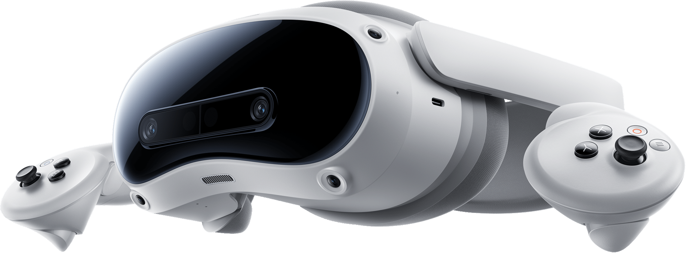
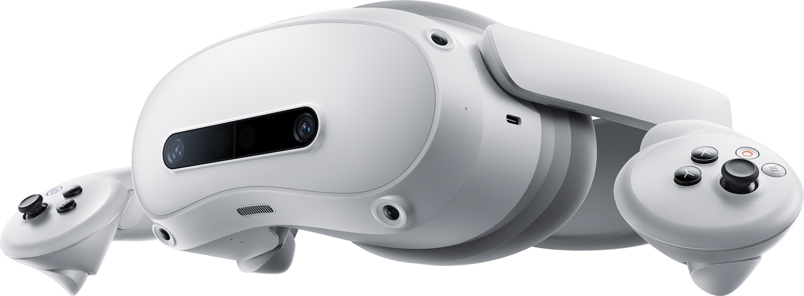
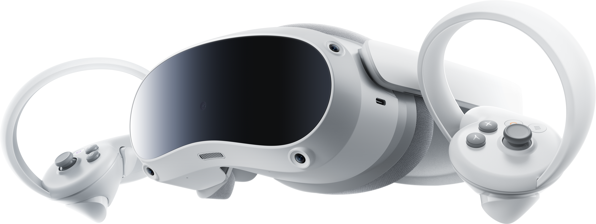
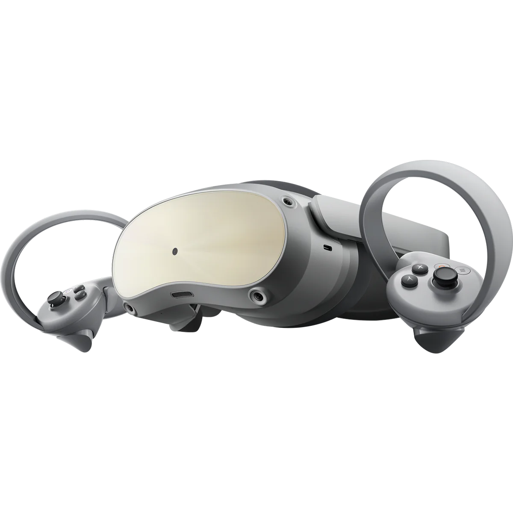

The PICO 4 series of headsets includes two main groups: `phoenix`, based on the Snapdragon XR2 Gen 1, and `sparrow`, based on the Snapdragon XR2 Gen 2.

All headsets have the same optics and form factor.

## `sparrow`

All `sparrow` headsets share the following:

| | |
|-|-|
| SoC | Snapdragon XR2 Gen2 |
| RAM | 12GB LPDDR5 |
| Storage | 256GB |
| Connectivity | BT 5.3, WiFi 7, USB-C |
| Passthrough | Binocular 32MP Colour |
| OS | PICO OS 5 (Ultra, Android 14) |
| Eye Tracking | No |
| Face Tracking | No |
| Automatic IPD | No |

They also share a much more modern version of PICO OS than the `phoenix` headsets.

All `sparrow` headsets come with PICO 4 Ultra Controllers without tracking rings.

### PICO 4 Ultra

Released 2024, the PICO 4 Ultra is a consumer headset.
It is identifiable by its black front and dual passthrough cameras.

| | |
|-|-|
| PCVR Streaming | PICO Connect |

### PICO 4 Ultra Enterprise

The PICO 4 Ultra Enterprise is the business variant of the PICO 4 Ultra.
It is identifiable by its white front and dual passthrough cameras.

It has identical hardware with an enterprise variant of PICO OS.

| | |
|-|-|
| PCVR Streaming | PICO Business Streaming (PICO Connect is sideloadable) |

## `phoenix`

All `phoenix` headsets share the following:

| | |
|-|-|
| SoC | Snapdragon XR2 |
| Connectivity | BT 5.1, WiFi 6, USB-C |
| Passthrough | Monocular 16MP Colour |

All `phoenix` headsets come with PICO 4 Controllers with tracking rings.

They are vulnerable to downgrade, userspace root, and bootloader unlock exploits.

### PICO 4

Released 2022, first in the PICO 4 family.
It is identifable by its black front and single passthrough camera.

| | |
|-|-|
| RAM | 8GB LPDDR4 |
| Storage | 128GB, 256GB |
| PCVR Streaming | PICO Connect |
| OS | PICO OS 5 (Non-Ultra, Android 10) |
| Eye Tracking | No |
| Face Tracking | No |
| Automatic IPD | No |

### PICO 4 Pro

{/* TODO: Proper picture! */}

Released only to the Chinese market.

The PICO 4 Pro and Enterprise are identifiable by their silver/gold reflective front panel.
A PICO 4 Pro has Chinese text on the stickers underneath the facial interface, and
and a PICO 4 Enterprise has English text.

| | |
|-|-|
| RAM | 8GB LPDDR5 |
| Storage | 512GB |
| PCVR Streaming | PICO Connect (Chinese build) |
| Eye Tracking | Yes |
| Face Tracking | Yes |
| Automatic IPD | Yes |

Notably, the PICO 4 Pro and PICO 4 Enterprise feature onboard eye tracking and face tracking.

It runs Chinese consumer firmware, so the PICO store is available, but only Chinese PICO accounts will work.

### PICO 4 Enterprise

Released only to businesses, the PICO 4 Enterprise is identical to the PICO 4 Pro, but with 256GB storage.

| | |
|-|-|
| RAM | 8GB LPDDR5 |
| Storage | 256GB |
| PCVR Streaming | PICO Business Streaming (PICO Connect is sideloadable) |
| Eye Tracking | Yes |
| Face Tracking | Yes |
| Automatic IPD | Yes |

It runs global enterprise firmware, so the PICO store has a very different selection of apps, you cannot login with
consumer PICO accounts, the streaming app is not standard PICO Connect (but you can sideload it!),
and the Business Settings can be accessed via `Settings > Developer`.
